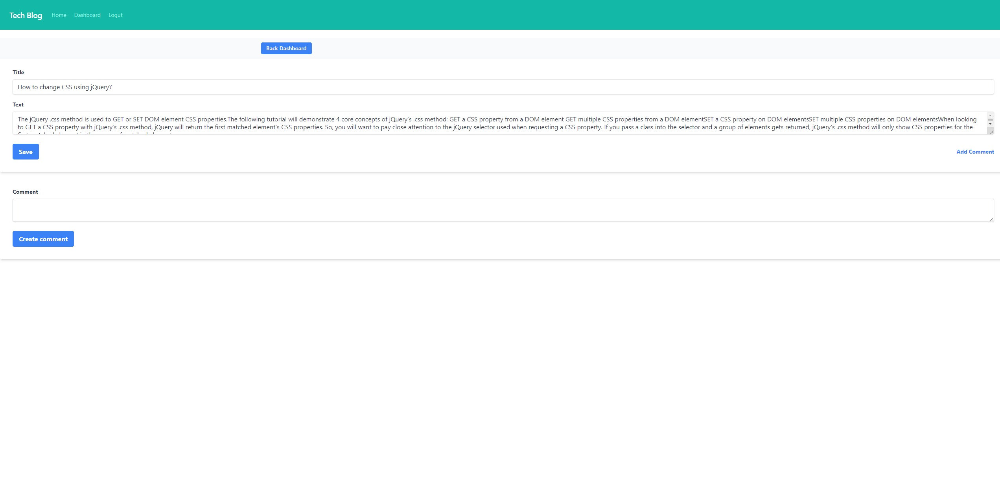

# Tech Blog

  

  ## Description
  - Tech Blog website where developers can publish their posts and comment on
    each others posts.
  - Application is being developed by following MVC paradigm and uses handlebars,
    sequelize, express-session.

  ## Table of Contents
  * [Installation](#installation)
  * [Usage](#usage)
  * [License](#license)
  * [Contributing](#contributing)
  * [Tests](#tests)
  * [Demo](#demo)
  * [Screenshot](#screenshot)
  * [Questions](#questions)

  ## Installation

  - Download `node` , install  `express, sequelize, mysql2, express-session, express-handlebars, bcrypt, connect-session-sequelize, dotenv` packages. If cloning from repo run `npm i` to install all modules.
  - Connect to the database by running `mysql -u root -p` and enter your password from .env file.
  - Run `source db/schema.sql` to create database.
  - Run `npm run seed` to seed data.
  - Lastly run `npm start` to connect to the server.

  ## Usage
  - This wil allow the the users to sign up and once they are logged in they wull be able to view their dashboard, create, edit and delete posts and comment on other posts.

  ## License
  This project is licensed under 

  ## Contributing
  - N/A

  ## Tests
  - N/A

  ## Demo

  - Please follow the [link]() to visit the page.
  

  ## Screenshot 

  
  
  
  

  ## Questions
  If you have any questions regarding the project you can contact me directly at artlil420@gmail.com.
  Please feel free to view more of my projects at https://github.com/Artur0705